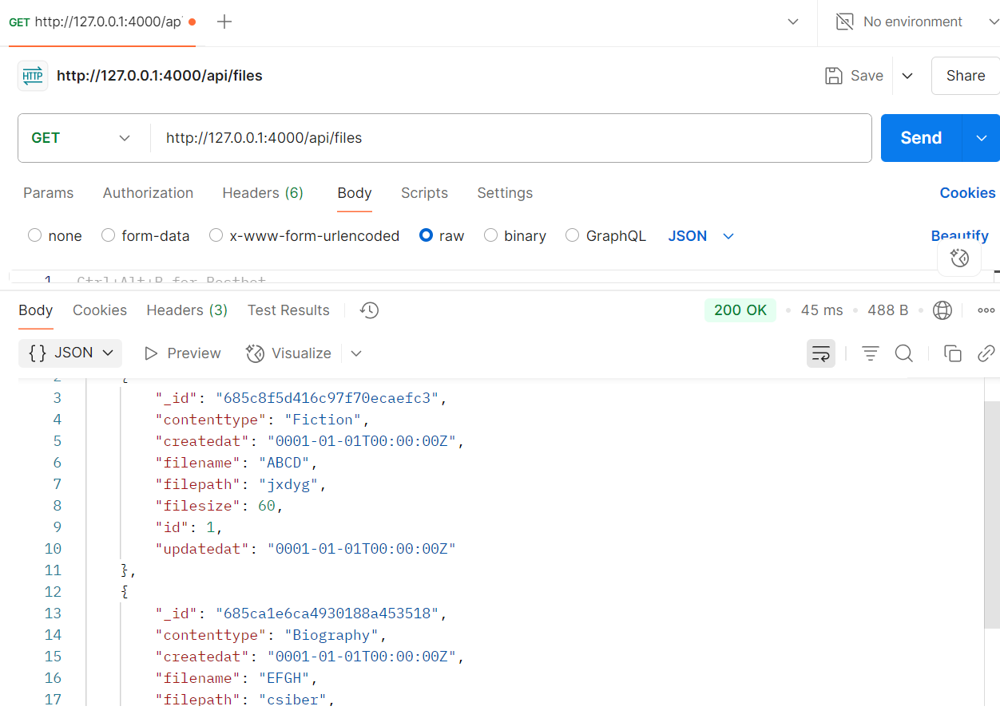
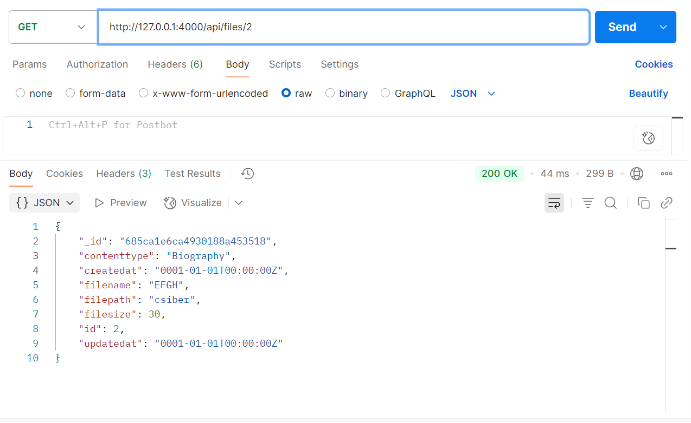
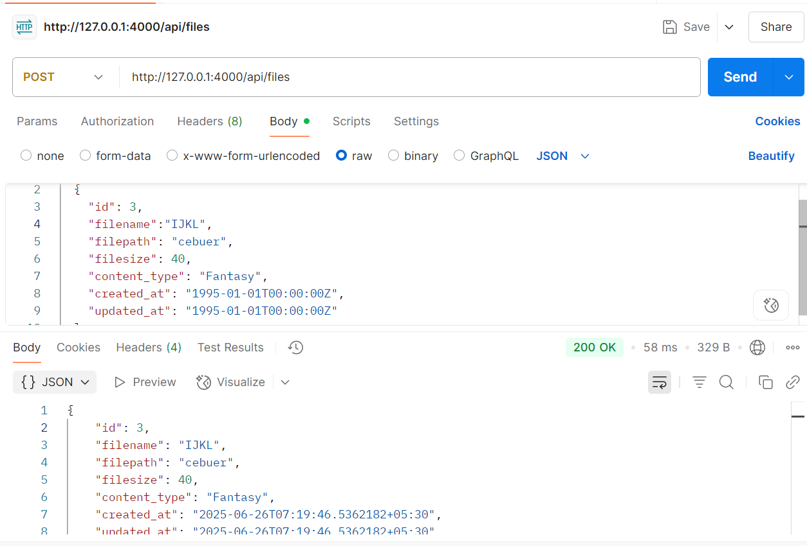
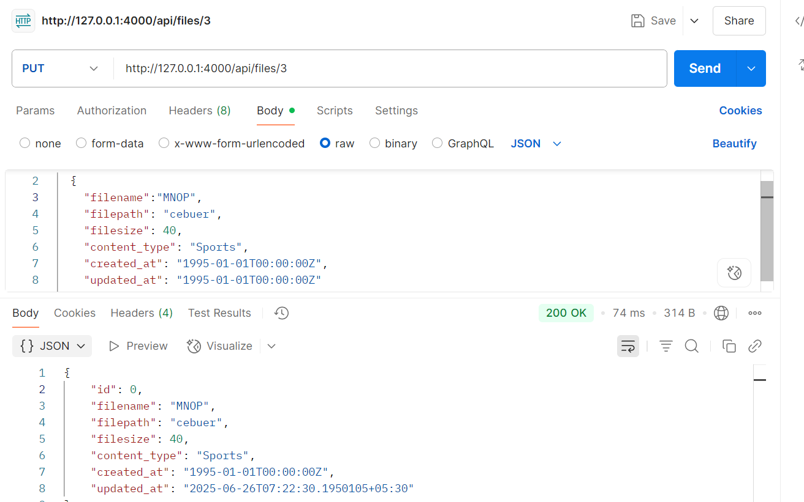
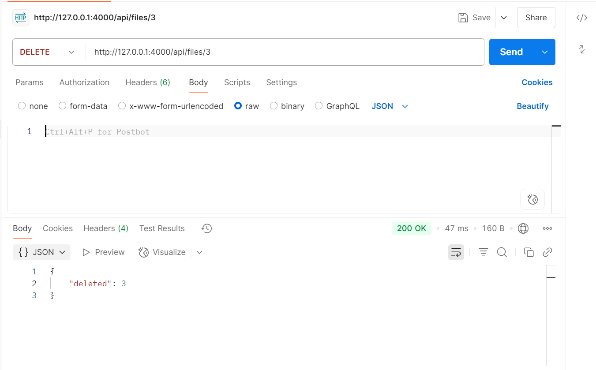

📁 FileNest CRUD API (Go + MongoDB)
A simple RESTful API built with Go, MongoDB, and Gorilla Mux, designed to perform Create, Read, Update, and Delete operations on file metadata records.

🚀 Features
🌐 RESTful API endpoints

📦 MongoDB Atlas integration

🧩 Modular project structure

✅ Input parsing and JSON serialization

🧪 Clean separation of concerns (controller, router, model)

📁 Project Structure
python
Copy
Edit
FileNest/
├── crud/
│   ├── controller/       # Business logic and DB operations
│   │   └── controller.go
│   ├── model/            # Data models
│   │   └── model.go
│   ├── router/           # API route definitions
│   │   └── router.go
│   ├── main.go           # App entry point
│   ├── go.mod            # Go module definition
│   └── go.sum            # Go dependencies lock file
🛠 Technologies Used
Go (1.20+)

MongoDB Atlas (Cloud MongoDB)

Gorilla Mux (HTTP Router)

MongoDB Go Driver v2

📦 Data Model
The API handles metadata for files using the following model:

go
Copy
Edit
type FileMetadata struct {
    ID          int       `json:"id"`
    FileName    string    `json:"filename"`
    FilePath    string    `json:"filepath"`
    FileSize    int64     `json:"filesize"`
    ContentType string    `json:"content_type"`
    CreatedAt   time.Time `json:"created_at"`
    UpdatedAt   time.Time `json:"updated_at"`
}
🔨 Implementation
1. Model Layer (model.go)
Defines the FileMetadata struct, which represents each file's metadata, including ID, filename, size, and timestamps. The struct is tagged with json and db tags for seamless encoding and MongoDB mapping.

2. Controller Layer (controller.go)
Handles:

Database connection via mongo.Connect() using the Go MongoDB Driver

CRUD logic:

createRecord() – Inserts a new document

getallRecords() – Retrieves all documents

getsingleRecord() – Fetches a specific document by id

updateRecord() – Updates fields like FilePath, FileSize, UpdatedAt

deleteRecord() – Deletes a document by id

HTTP handlers (CreateRecord, GetAllRecords, etc.) use Gorilla Mux to parse request parameters and body.

3. Router Layer (router.go)
Maps HTTP endpoints to corresponding controller functions using the Gorilla Mux router:

GET /api/files → Get all records

GET /api/files/{id} → Get a single record

POST /api/files → Create a record

PUT /api/files/{id} → Update a record

DELETE /api/files/{id} → Delete a record

4. Entry Point (main.go)
Bootstraps the application:

Calls the Router() function to set up routes

Starts the HTTP server on port 4000

🔗 API Endpoints
Method	Endpoint	Description
GET	/api/files	Get all file records
GET	/api/files/{id}	Get a single file record
POST	/api/files	Create a new record
PUT	/api/files/{id}	Update a file record
DELETE	/api/files/{id}	Delete a file record

🧪 Sample Payload (POST/PUT)
json
Copy
Edit
{
  "id": 1,
  "filename": "example.pdf",
  "filepath": "/documents/example.pdf",
  "filesize": 2048,
  "content_type": "application/pdf",
  "created_at": "2025-06-26T10:00:00Z",
  "updated_at": "2025-06-26T10:00:00Z"
}
⚙️ Setup Instructions
1. Clone the Repository
bash
Copy
Edit
git clone https://github.com/IshatV412/FileNest.git
cd FileNest/crud
2. Configure MongoDB
Update the connectionString in controller.go with your MongoDB Atlas URI:

go
Copy
Edit
const connectionString = "your-mongodb-uri"
3. Initialize Go Modules
bash
Copy
Edit
go mod tidy
4. Run the Server
bash
Copy
Edit
go run main.go

POSTMAN SS

🧼 Notes
All API responses are in JSON.

Assumes MongoDB documents are indexed by id: int.

Includes CORS method headers for POST/PUT/DELETE support.

This version is local-dev friendly and does not use Docker or production hardening.

🙋‍♀️ Contributing
Pull requests are welcome. Please ensure code is tested and documented.

📝 License
MIT License © 2025 Ishat Varshney

