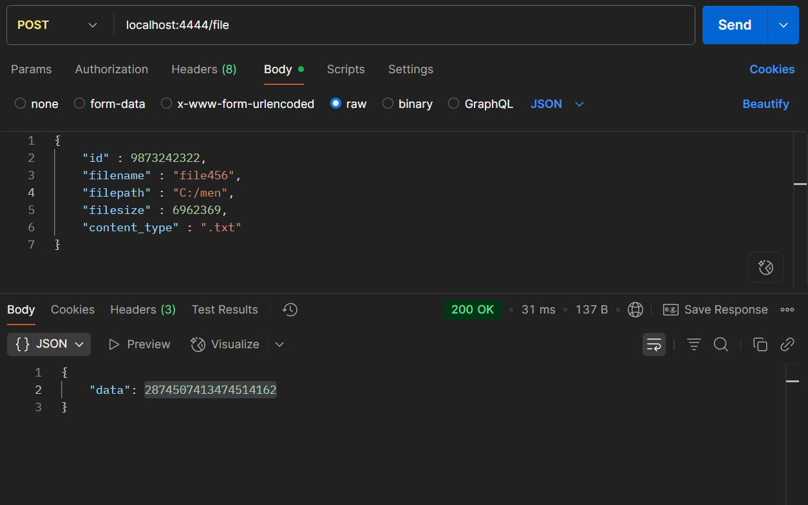
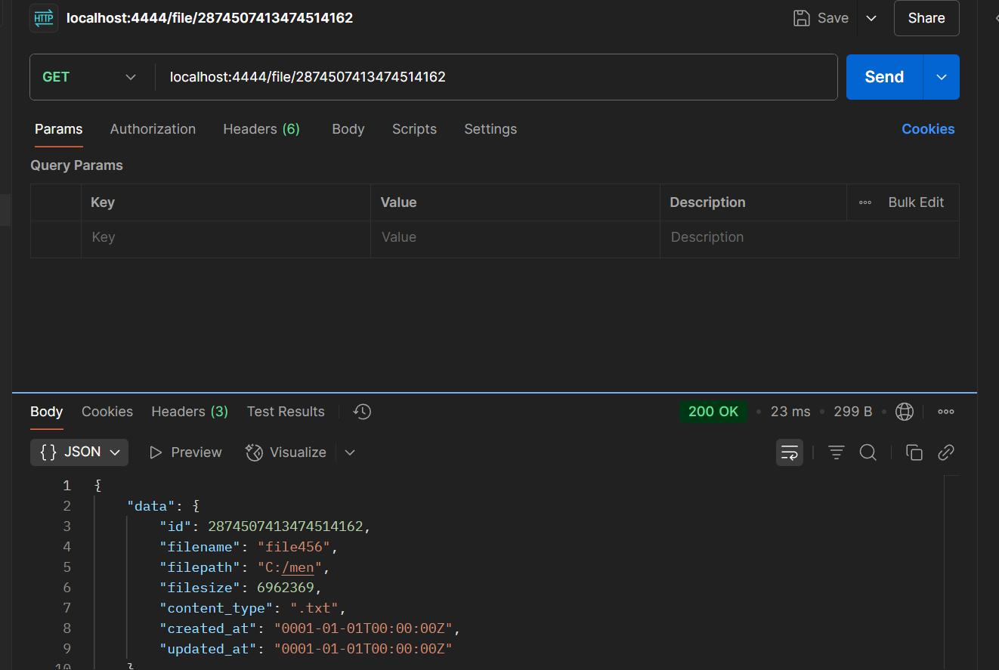
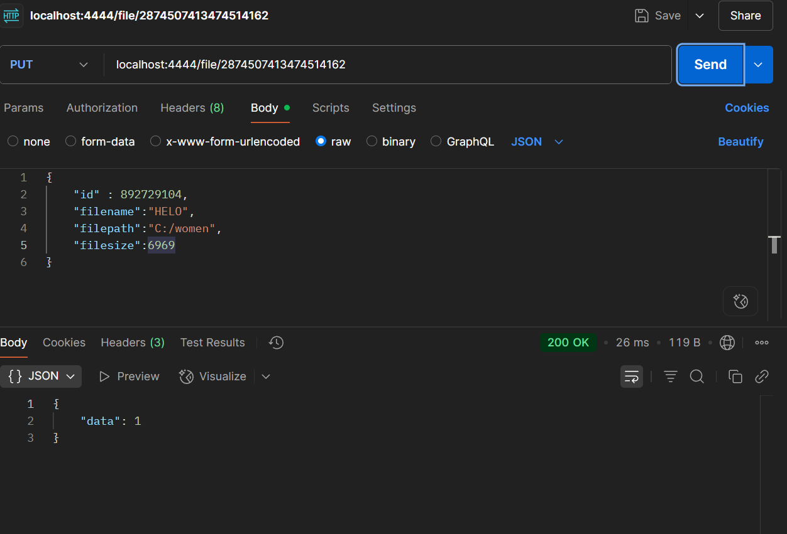
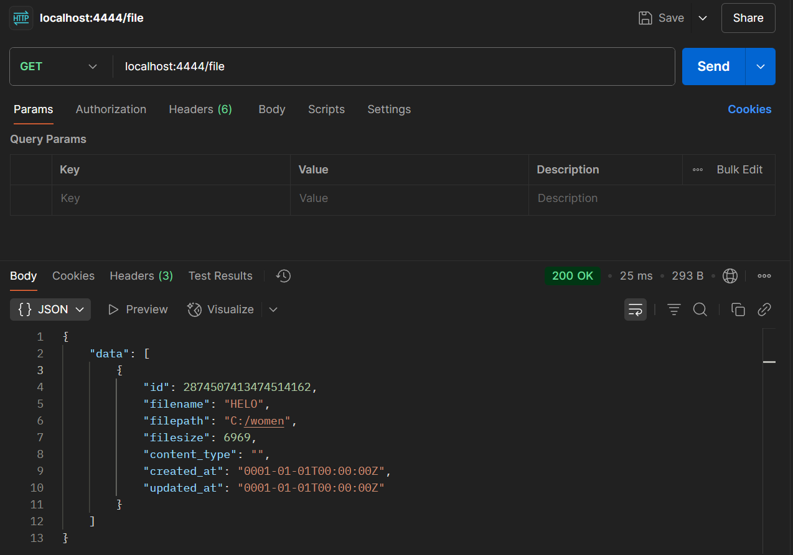

# CRUD Service for File Metadata

This project provides a simple CRUD (Create, Read, Update, Delete) API for managing file metadata using Go, MongoDB, and Gorilla Mux. Below is a description of the main files in the `crud` directory:

## File Overview

### main.go
- Entry point for the application.
- Loads environment variables, connects to MongoDB, and sets up HTTP routes.
- Registers endpoints for health check and all file operations (create, read, update, delete).

### usecase/filemetadata.go
- Contains the `FileService` struct and handler methods for each API endpoint.
- Implements business logic for creating, retrieving, updating, and deleting file metadata.
- Handles HTTP requests and responses.

### repository/filemetadata.go
- Defines the `FileMetadataRepo` struct and methods for interacting with MongoDB.
- Implements database operations for file metadata (insert, find, update, delete).

### repository/filemetadata_test.go
- Contains unit tests for the repository layer.
- Tests CRUD operations against a test MongoDB collection.

### model/filemetadata.go
- Defines the `FileMetadata` struct representing the file metadata schema.
- Used by both the usecase and repository layers.

## How to Run

1. Set up a `.env` file with the following variables:
   - `MONGO_URI`: MongoDB connection string
   - `DB_NAME`: Database name
   - `COLLECTION_NAME`: Collection name
2. Run `go mod tidy` to install dependencies.
3. Start the server:
   ```sh
   go run main.go
   ```
4. The API will be available at `http://localhost:4444`.

## Endpoints
- `GET /health` — Health check
- `POST /file` — Create a new file metadata entry
- `GET /file/{id}` — Get file metadata by ID
- `GET /file` — Get all file metadata
- `PUT /file/{id}` — Update file metadata by ID
- `DELETE /file/{id}` — Delete file metadata by ID
- `DELETE /file` — Delete all file metadata

## Dependencies
- [Gorilla Mux](https://github.com/gorilla/mux)
- [MongoDB Go Driver](https://go.mongodb.org/mongo-driver)
- [godotenv](https://github.com/joho/godotenv)

---


For more details, see comments in each file or contact the project maintainer.

## Testing



