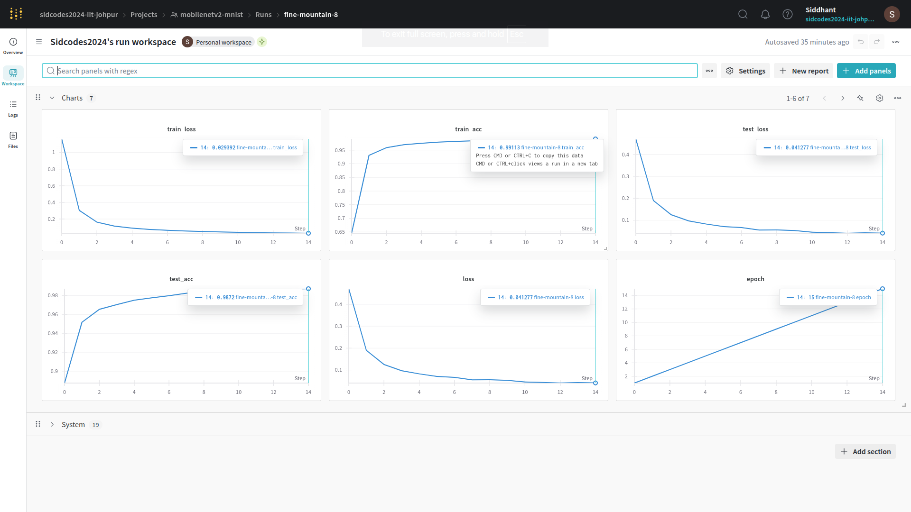
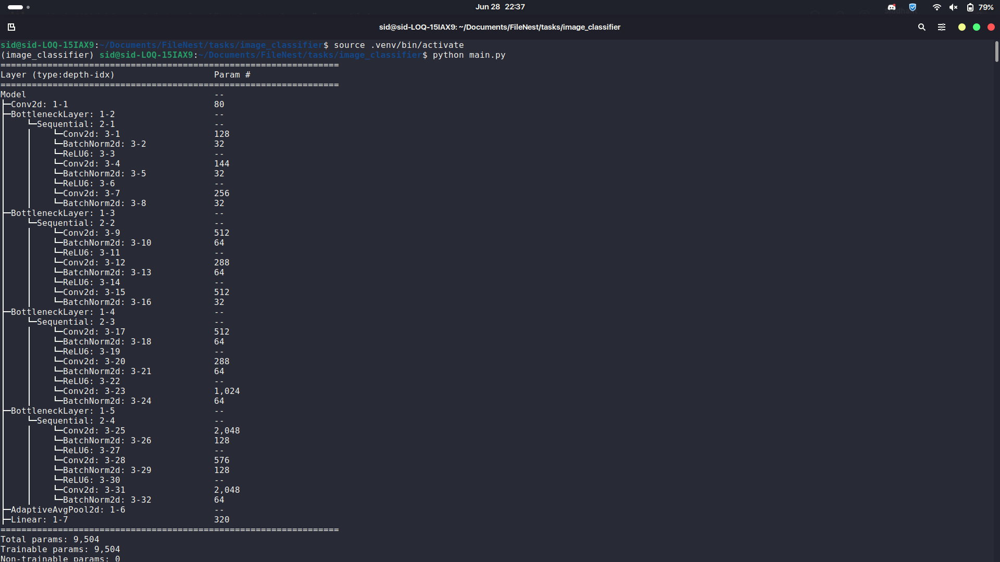
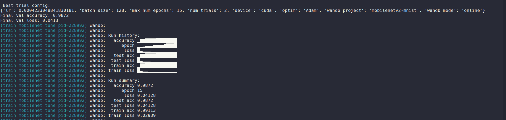

# Image Classifier

A PyTorch-based image classifier for MNIST, featuring experiment tracking, hyperparameter tuning, configuration management, and Docker support.

## Features

- MobileNetV2-inspired model in PyTorch
- Data loading and preprocessing with torchvision
- Model summary with torchinfo
- Experiment tracking with Weights & Biases (wandb)
- Hyperparameter tuning with Ray Tune
- Configuration management using Hydra and OmegaConf
- **Docker support** for reproducible environments

## Project Structure

```
tasks/image_classifier/
├── assets/                 # Screenshots and visualizations
├── conf/
│   └── config.yaml         # Training and experiment config
├── data.py                 # Data loaders for MNIST
├── main.py                 # Entry point, Ray Tune + Hydra integration
├── model.py                # Model definition
├── model.ipynb             # Jupyter notebook for model exploration
├── requirements.txt        # Python dependencies
├── train.py                # Training and validation logic
├── Dockerfile              # Docker container specification
└── README.md               # Project documentation
```

## Installation

1. Clone the repository.
2. Install dependencies:
   ```bash
   pip install -r requirements.txt
   ```

## Usage

Run the main experiment (with Ray Tune and Hydra):
```bash
python main.py
```

You can modify hyperparameters and settings in [`conf/config.yaml`](conf/config.yaml).

## Configuration

- All training and experiment settings are managed via Hydra config files in the `conf/` directory.
- You can override config values from the command line, e.g.:
  ```bash
  python main.py lr=0.01 batch_size=32
  ```

## Docker

Build and run the project in a Docker container:

```bash
docker build -t image-classifier .
docker run --gpus all --rm image-classifier
```

- The Dockerfile uses the official PyTorch image with CUDA support.
- All dependencies are installed inside the container.

## Dependencies

- torch
- torchvision
- torchinfo
- wandb
- ray[tune]
- hydra-core
- omegaconf

## Results & Metrics

After training, you can view metrics and compare runs in your [Weights & Biases dashboard](https://wandb.ai/).

### 📊 Metrics Screenshots

Paste your screenshots into the `assets/` folder and reference them below:

- **WandB Metrics:**  
  

- **Model Summary:**  
  

- **Ray Tune Metrics:**  
  
