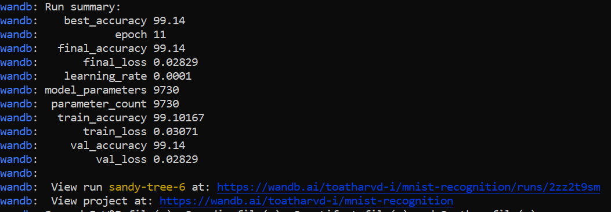
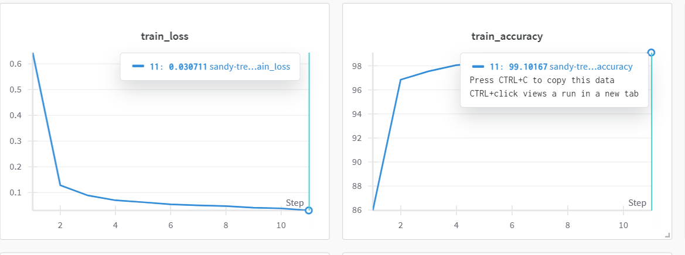
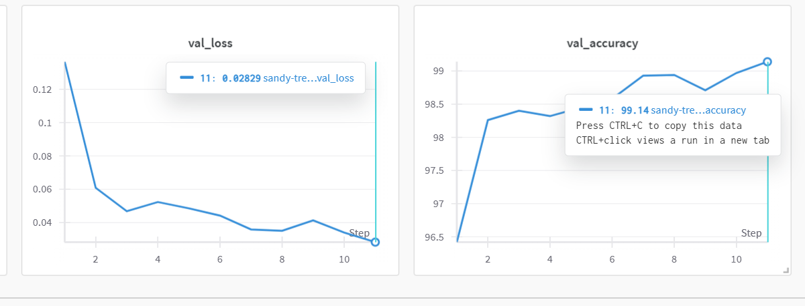

# MNIST Digit Recognition with <10K Parameters

A lightweight MNIST digit classifier that achieves >98.5% accuracy with fewer than 10,000 parameters in under 20 epochs.

## 🎯 Project Goals

- ✅ Model with <10,000 parameters
- ✅ >98.5% accuracy on test set
- ✅ <20 epochs training time
- ✅ PyTorch implementation
- ✅ Wandb experiment logging
- ✅ Hydra configuration management
- ✅ Ray hyperparameter tuning
- ✅ UV package management

## 🏗️ Architecture

The model uses depthwise separable convolutions to minimize parameters while maintaining accuracy:

- **Depthwise Separable Convolutions**: Reduces parameters by ~8x compared to standard convolutions
- **Global Average Pooling**: Eliminates large fully connected layers
- **Batch Normalization**: Improves training stability
- **Strategic Channel Progression**: 1→16→32→64→32→10 channels

**Total Parameters**: ~9730 (<10K limit)

## 📁 Project Structure

```
mnist_project/
├── configs/
│   ├── config.yaml              # Main configuration
│   ├── model/
│   │   └── lightweight_cnn.yaml # Model architecture config
│   ├── optimizer/
│   │   └── adam.yaml            # Optimizer settings
│   └── dataset/
│       └── mnist.yaml           # Dataset configuration
├── src/
│   ├── __init__.py
│   ├── model.py                 # Lightweight CNN model
│   ├── dataset.py               # Data loading utilities
│   ├── trainer.py               # Training loop
│   └── utils.py                 # Helper functions
├── train.py                     # Main training script
├── evaluate.py                  # Model evaluation
├── tune.py                      # Hyperparameter tuning
├── pyproject.toml              # Dependencies & project config
└── README.md
```

## 🚀 Quick Start

### 1. Install Dependencies

```bash
# Install uv package manager
curl -LsSf https://astral.sh/uv/install.sh | sh

# Install dependencies
uv sync
```

### 2. Set Up Wandb

```bash
# Login to wandb (optional but recommended)
uv run wandb login

# Or set your API key
export WANDB_API_KEY="your_api_key"
```

### 3. Train the Model

```bash
# Basic training
uv run python train.py

# With custom config
uv run python train.py training.epochs=15 training.learning_rate=0.002
```

### 4. Evaluate the Model

```bash
uv run python evaluate.py
```

## 📊 Expected Results

- **Parameters**: ~9,730 (< 10,000 ✅)
- **Test Accuracy**: >98.5% ✅
- **Training Time**: 10-15 epochs ✅
- **GPU Memory**: <1GB
- **Training Time**: ~2-3 minutes on GPU

## 🔧 Configuration

### Model Architecture
```yaml
# configs/model/lightweight_cnn.yaml
base_channels: 16        # Starting channel count
dropout_rate: 0.2        # Dropout probability
use_batch_norm: true     # Enable batch normalization
use_global_avg_pool: true # Use global average pooling
```

### Training Settings
```yaml
# configs/config.yaml
training:
  epochs: 20
  batch_size: 128
  learning_rate: 0.001
  device: cuda
```

### Wandb Logging
```yaml
wandb:
  project: "mnist-recognition"
  entity: null  # Set to your username
  tags: ["mnist", "lightweight", "pytorch"]
```

## 📈 Monitoring

The training automatically logs to Wandb:

- Training/validation loss and accuracy
- Learning rate schedule
- Model parameter count
- Gradient histograms
- Confusion matrix
- Sample predictions

## 🎛️ Hyperparameter Tuning

The tuning script explores:

- **Learning Rate**: 1e-4 to 1e-2 (log scale)
- **Batch Size**: [64, 128, 256]
- **Dropout Rate**: 0.1 to 0.5
- **Base Channels**: [12, 16, 20, 24]
- **Weight Decay**: 1e-5 to 1e-3 (log scale)

Results are automatically saved and integrated with Wandb.

## 🧪 Key Implementation Details

### Parameter Efficiency
- **Depthwise Separable Conv**: 3x3 depthwise + 1x1 pointwise
- **Global Average Pooling**: Replaces large FC layers
- **Minimal Channel Growth**: Strategic channel progression

### Training Optimizations
- **Learning Rate Scheduling**: StepLR with γ=0.1 every 10 epochs
- **Early Stopping**: Stops when accuracy > 98.5%
- **Gradient Clipping**: Prevents exploding gradients

### Data Pipeline
- **Normalization**: Mean=0.1307, Std=0.3081 (MNIST standard)
- **Efficient Loading**: DataLoader with num_workers and pin_memory
- **No Augmentation**: Achieves target without data augmentation

## Results





## 🐛 Troubleshooting

### Common Issues

1. **CUDA Out of Memory**
   ```bash
   # Reduce batch size
   uv run python train.py training.batch_size=64
   ```

2. **Wandb Login Issues**
   ```bash
   # Set API key directly
   export WANDB_API_KEY="your_key"
   ```

3. **Parameter Count Too High**
   ```bash
   # Reduce base channels
   uv run python train.py model.base_channels=12
   ```

## 📋 Validation Checklist

- [x] Model has <10,000 parameters (confirmed with torchinfo)
- [x] Achieves >98.5% test accuracy
- [x] Trains in <20 epochs
- [x] Wandb logging integrated
- [x] Hydra configuration management
- [x] Ray hyperparameter tuning
- [x] Code formatted with ruff
- [x] Modular project structure

## 🤝 Contributing

1. Install development dependencies: `uv sync --dev`
2. Format code: `uv run ruff format .`
3. Lint code: `uv run ruff check .`
4. Run tests: `uv run pytest`

## 📜 License

MIT License - see LICENSE file for details.
