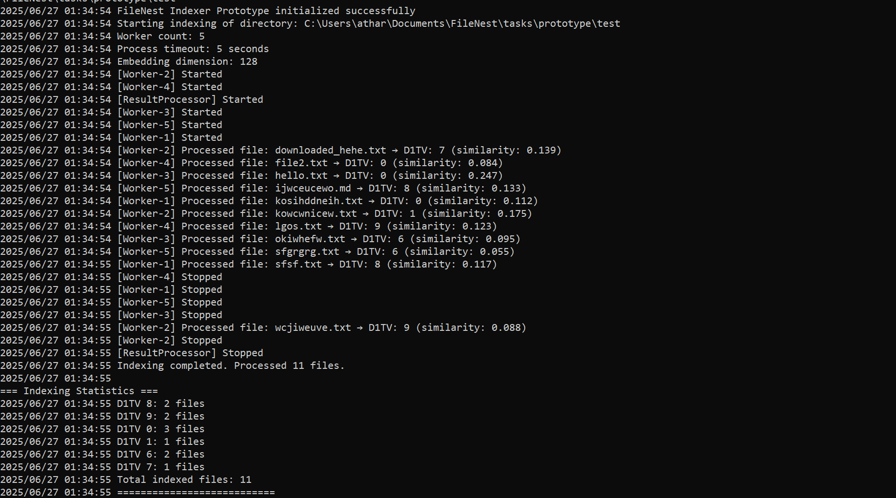
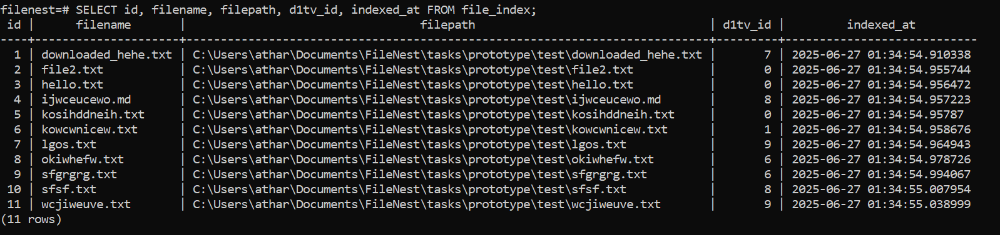

# FileNest Local Indexer Prototype

A concurrent file indexer prototype for the FileNest Framework that processes files locally and stores embeddings in PostgreSQL.

## Features

- **Concurrent Processing**: Worker pool with configurable number of goroutines
- **Context Cancellation**: Graceful shutdown with Ctrl+C support
- **Cosine Similarity**: Assigns files to nearest Depth 1 Tagging Vector (D1TV)
- **PostgreSQL Storage**: Efficient storage with conflict resolution
- **Multiple File Types**: Supports .txt, .md, .json, .py, .go, .js, .html
- **Deterministic Embeddings**: Reproducible results for the same content

## Setup

1. **Navigate to prototype directory**:
```bash
cd tasks/prototype
```

2. **Database Setup**:
```sql
CREATE DATABASE filenest;
CREATE USER filenest_user WITH PASSWORD 'your_password';
GRANT ALL PRIVILEGES ON DATABASE filenest TO filenest_user;
```

3. **Environment Configuration**:
```bash
cp .env.example .env
# Edit .env with your database credentials
```

4. **Build and Run**:
```bash
go mod tidy
go build -o prototype cmd/main.go
./prototype index /path/to/your/directory
```

## Usage

```bash
# Index a directory
./prototype index ./test-files

# With custom path flag
./prototype index -p ./documents ./documents
```

## Architecture

- **Worker Pool**: Configurable number of concurrent workers
- **Job Distribution**: Channel-based job queue with backpressure
- **Result Processing**: Separate goroutine for database operations
- **Timeout Handling**: Per-file processing timeout (default 5s)
- **Graceful Shutdown**: Context cancellation propagated to all goroutines

## Database Schema

```sql
CREATE TABLE file_index (
    id SERIAL PRIMARY KEY,
    filename TEXT NOT NULL,
    filepath TEXT NOT NULL UNIQUE,
    embedding FLOAT8[] NOT NULL,
    d1tv_id INT NOT NULL,
    indexed_at TIMESTAMP DEFAULT now()
);
```

## Performance

- **Concurrent Processing**: 5 workers by default
- **File Size Limit**: 1MB per file
- **Timeout**: 5 seconds per file
- **Connection Pool**: 10 max connections to PostgreSQL

## Configuration

Environment variables:
- `DATABASE_URL`: PostgreSQL connection string
- `WORKER_COUNT`: Number of concurrent workers (default: 5)
- `PROCESS_TIMEOUT`: Timeout per file in seconds (default: 5)
- `EMBEDDING_DIM`: Embedding vector dimension (default: 128)

## Integration with Main Repository

This prototype is designed to be part of a larger GitHub repository structure:
- Located in `tasks/prototype/` directory
- Self-contained Go module
- Can be run independently or integrated into larger build processes
- Uses proper Go module naming convention for sub-packages

## Working

Assigning of D1TV tags concurrently to each of the files


Inserted file-D1TV values in Postgres Database
