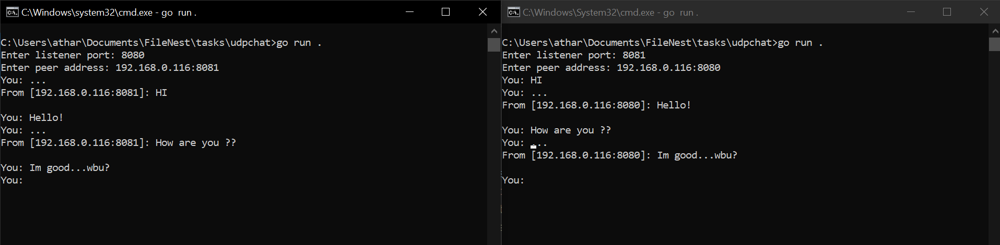

# UDPChat

A simple peer-to-peer (P2P) chat application using UDP sockets in Go. Each peer can both send and receive messages using a fixed port, so the sender's port is always visible to the receiver.

## How It Works
- Each peer runs the same program and listens on a user-specified UDP port.
- You enter the address (IP:port) of the peer you want to chat with.
- Messages are sent and received using the same UDP socket, so the sender's port is always the listening port.

## Usage

### 1. Build
```
go build -o udpchat p2psharing.go
```

### 2. Run Two Peers (in separate terminals)

#### Peer 1 Example
```
$ ./udpchat
Enter listener port: 8080
Enter peer address: 127.0.0.1:8081
You: 
```

#### Peer 2 Example
```
$ ./udpchat
Enter listener port: 8081
Enter peer address: 127.0.0.1:8080
You: 
```

## Result
Simulating 2 peer chat on different ports

- Type messages and press Enter to send.
- Received messages will show the sender's IP and port.

## Notes
- Use `127.0.0.1` for local testing, or your LAN IP for networked peers.
- Both peers must use different listening ports.
- The sender's port shown in received messages will always match the peer's listening port.

## Example Output
```
...
From [127.0.0.1:8081]: Hello!
You: 
```

## License
MIT
